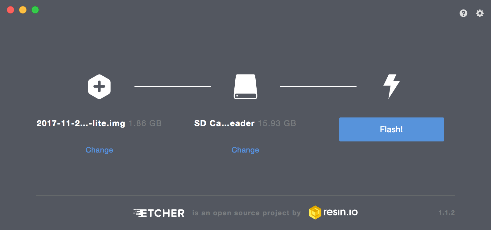

# Physical servers
For the purpose of clarity, for this section the term physical server refers to
a Raspberry Pi. But, any computer with a power cable, a network card, and an
ethernet cable will suffice.

## Requirements
For each server we require the following:

* Raspberry Pi
* Micro USB cable
* Power adapter (Approx. 2 Amps)
* Ethernet cable
* SD card with capacity 16GB or greater

## Video tutorial
You can watch the video tutorial or follow the screenshots.

<iframe class="video" src="https://www.youtube.com/embed/wa5ze_dImBY" frameborder="0" allow="autoplay; encrypted-media" allowfullscreen></iframe>

## Setting up the Operating System
We must prepare the operating system for the server's first boot.

1. Download the [Raspbian Stretch Lite Image][raspbian_download]

2. Download, install, and run [Etcher][etcher_download]

3. Click "Select Image," select the downloaded Raspbian Image and if Etcher does not automatically detect your SD card, click "Select Drive" and select your SD card. Then click "Flash". This will burn the Raspbian Image to the SD card.

## Enable SSH
By default SSH is not enabled in Raspbian. We must manually enable it.

1. Eject, remove, and reinsert the SD card. The "boot" partition should appear in Finder, or Explorer in Windows

2. Create an empty file on your Desktop named "ssh". Drag it to the "boot" partition of the SD card

## Connecting the hardware
Now, we need to prepare the physical device.

1. Insert the SD card into the Raspberry Pi

2. Connect the Raspberry Pi to the router via ethernet

3. Connect the Micro USB to the Raspberry Pi, and a power source. The Raspberry Pi should come on. We do not need to connect a keyboard or monitor
to it because we have enabled SSH access and connected it to our network.

We repeat these steps for each physical server we would like to add to our network.

[raspbian_download]: https://www.raspberrypi.org/downloads/raspbian/
[etcher_download]: https://etcher.io/
